# Primeros pasos con R y RStudio
Sebastián Valdivia Ramírez
marzo 2025

 

## Descarga e Instalación de R

Para instalar la última versión disponible de R ingrese al sitio web de
CRAN (*The Comprehensive R Archive Network*) haciendo clic en el link
<https://cran.r-project.org/bin/windows/base/>. Una vez allí descargue
la versión de R más actualizada que se encuentre disponible.

A modo de ejemplo, la <a href="#fig-1" class="quarto-xref">Figura 1</a>
muestra que la versión disponible al 2025-03-11 corresponde a la 4.4.3.
Para descargarla haca clic en `Download R-4.4.3 for Windows`.

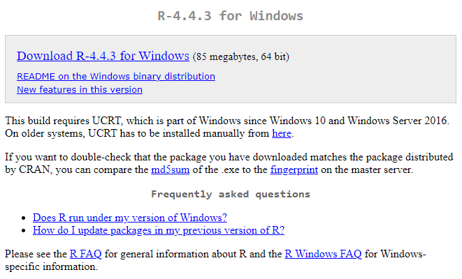

Figura 1: Descarga de R desde CRAN

> [!NOTE]
>
> Para descargar la versión de R compatible con MacOS ingrese a este
> link <https://cran.r-project.org/bin/macosx/>.

Al abrir el archivo recién descargado se desplegarán una serie de
ventanas que configuran la instalación del lenguaje R. Siga las
instrucciones que aparecen en las imágenes que se muestran a
continuación.

1.  **Seleccione** el idioma **Español** y presione
    **Siguiente**.(<a href="#fig-2" class="quarto-xref">Figura 2</a>).

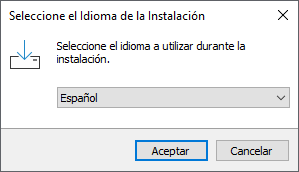

Figura 2: Idioma de instalación

 

2.  Presione **Siguiente** para aceptar las condiciones de uso.
    (<a href="#fig-3" class="quarto-xref">Figura 3</a>).

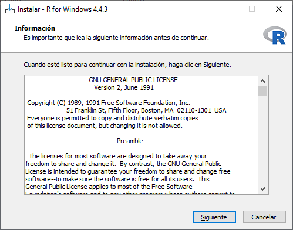

Figura 3: Condiciones de uso de R

 

3.  Haga clic en **Siguiente** para **aceptar la ruta de instalación**
    que viene por defecto.
    (<a href="#fig-4" class="quarto-xref">Figura 4</a>).

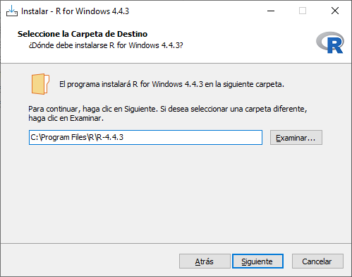

Figura 4: Directorio de instalación de R

 

4.  En la ventana de la
    <a href="#fig-5" class="quarto-xref">Figura 5</a> **desactive la
    casilla Message translations** y luego **presione** **Siguiente**.

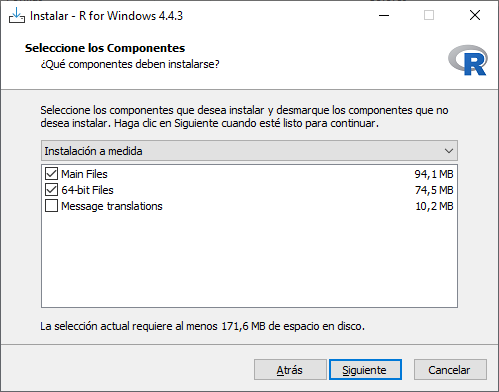

Figura 5: Componentes de instalación

> [!WARNING]
>
> Debido a que la mayoría de la documentación y literatura de R está en
> inglés recomendamos fuertemente que desactiven la casilla *Message
> translations*.

 

5.  En la ventana de la
    <a href="#fig-6" class="quarto-xref">Figura 6</a> **escoja la
    opción** **No** y luego **presione** **Siguiente**.

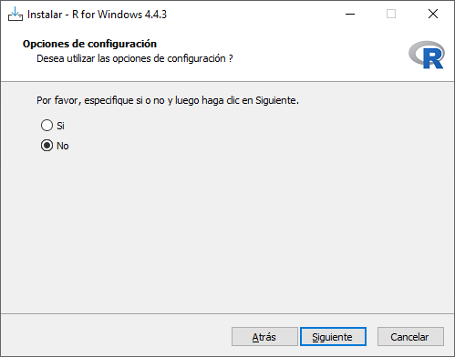

Figura 6: Componentes de instalación

 

6.  En la ventana de la
    (<a href="#fig-7" class="quarto-xref">Figura 7</a>) **presione**
    **Siguiente** para aceptar que se cree una carpeta en el Menú
    Inicio.

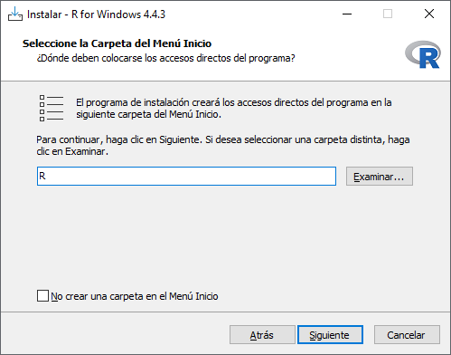

Figura 7: Componentes de instalación

 

7.  **Modifique las casillas** de acuerdo a la
    <a href="#fig-8" class="quarto-xref">Figura 8</a> y luego
    **presione** **Siguiente** para comenzar con la instalación.

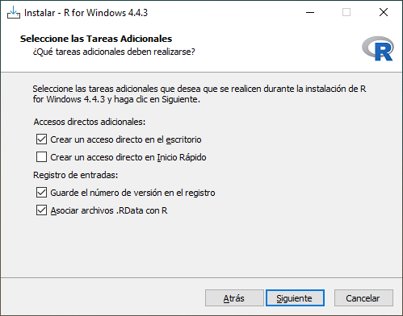

Figura 8: Componentes de instalación

 

Una vez que haya finalizado la instalación aparecerá una ventana similar
a la <a href="#fig-9" class="quarto-xref">Figura 9</a>. **Presione
Finish** para terminar.

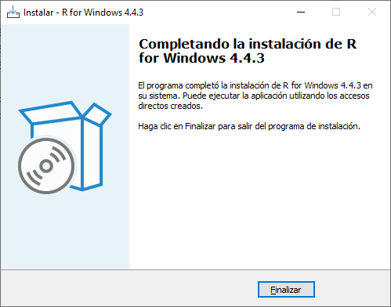

Figura 9: Componentes de instalación

 

Para comprobar que la instalación se haya realizado correctamente haga
clic en el Menú Inicio \> carpeta R, y luego abra el archivo que
pertenezca a la versión recién instalada. Si la ventana que aparece es
similar a la (<a href="#fig-10" class="quarto-xref">Figura 10</a>)
significa que R se instaló en su computador.

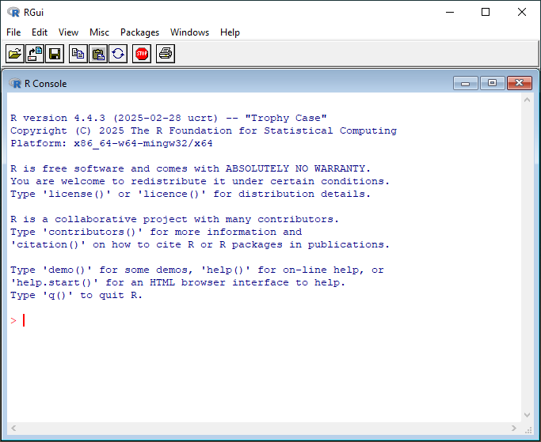

Figura 10: Componentes de instalación

## Descarga e Instalación de RStudio

Ingrese al sitio web <https://posit.co/download/rstudio-desktop/> para
descargar RStudio y escoja la última versión que aparezca disponible
haciendo clic en el botón `DOWNLOAD RSTUDIO DESKTOP FOR WINDOWS`
(<a href="#fig-11" class="quarto-xref">Figura 11</a>). En el caso que su
sistema operativo sea distinto a Windows (por ejemplo, MacOS o Linux)
baje hasta la sección `All Installers and Tarballs` y descargue el
instalador correspondiente a su sistema operativo.

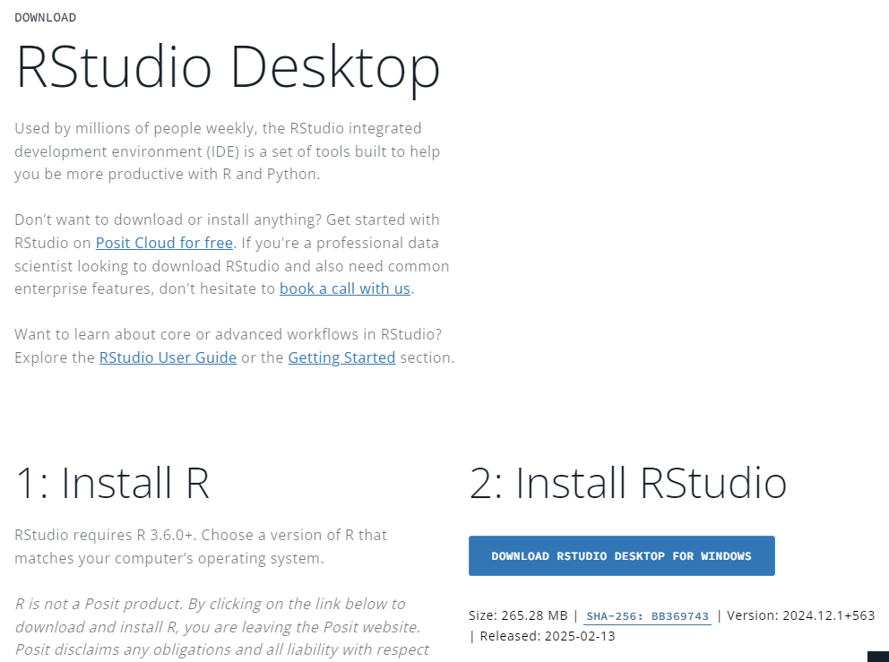

Figura 11: Componentes de instalación

 

Una vez finalizada la descarga abra el archivo descargado lo que
desplegará la ventana de inicio de instalación de RStudio
(<a href="#fig-12" class="quarto-xref">Figura 12</a>). Siga las
instrucciones que aparecen en las imágenes que se muestran a
continuación.

1.  **Presione** el botón **Siguiente**
    (<a href="#fig-12" class="quarto-xref">Figura 12</a>).

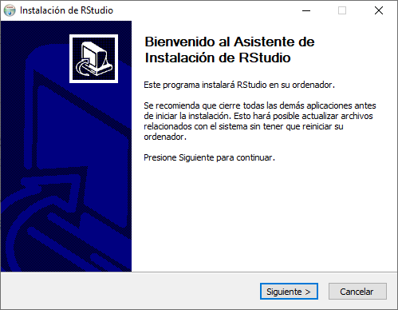

Figura 12: Componentes de instalación

 

2.  **Acepte la ruta de instalación** que aparece por defecto
    (<a href="#fig-13" class="quarto-xref">Figura 13</a>). **Para
    finalizar** la instalación **haga clic** en **Instalar**.

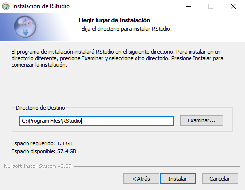

Figura 13: Componentes de instalación

 

3.  Una vez finalizada la instalación aparecerá una ventana similar a la
    <a href="#fig-14" class="quarto-xref">Figura 14</a>. Haga **clic**
    en **Terminar** para completar el proceso de instalación.

    

    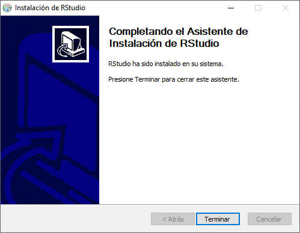

    Figura 14: Componentes de instalación

    

Para comprobar que RStudio se instaló correctamente haga clic en el Menú
Inicio y luego en la aplicación RStudio. Si se despliega una ventana
similar a la <a href="#fig-15" class="quarto-xref">Figura 15</a>
significa que la instalación se realizó de forma correcta.

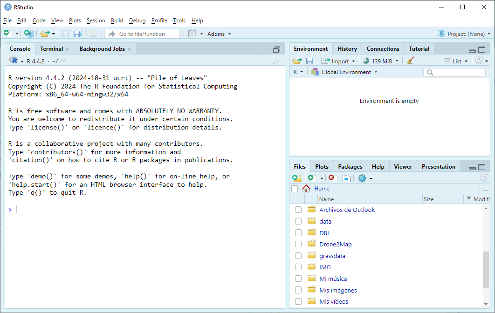

Figura 15: Ventana principal de RStudio

## Configuración inicial de RStudio

A continuación se configurarán algunas opciones generales que serán de
ayuda para interactuar de manera más fácil con RStudio.

En la barra superior de la ventana de RStudio
(<a href="#fig-15" class="quarto-xref">Figura 15</a>) haga clic en
`Tools`\> seleccione `Global Options` \> sección `General` \> y luego en
la pestaña `Basic`
(<a href="#fig-16" class="quarto-xref">Figura 16</a>).

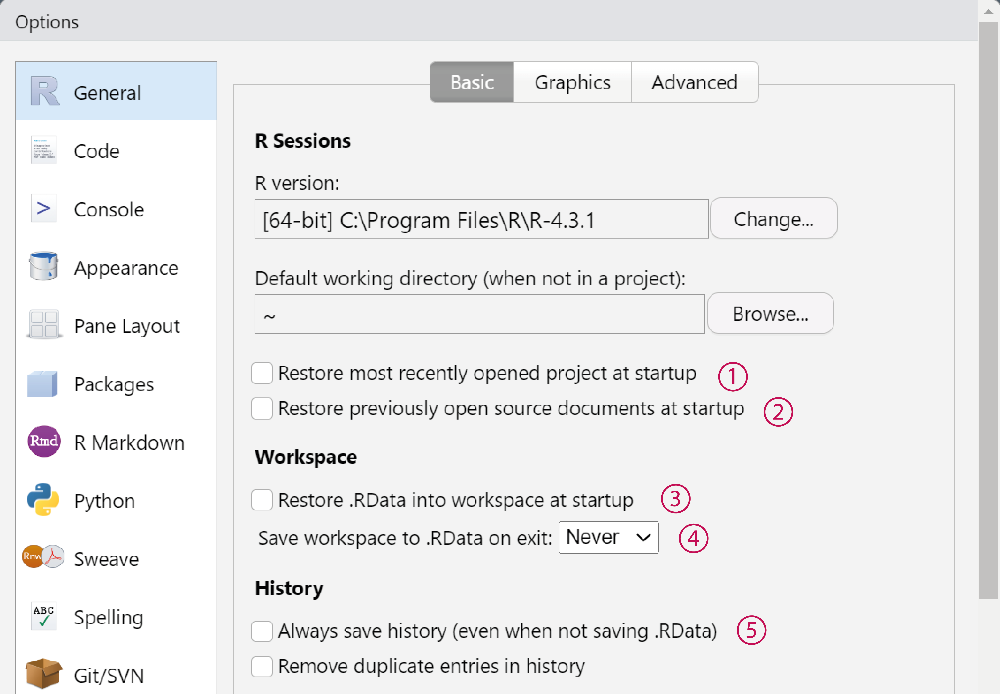

Figura 16: Global options \> General \> Basic

Observe esta pestaña y ajuste las opciones de acuerdo a lo siguiente:

- **Desactivar** la **casilla** “Restore most recently opened project at
  startup” **(1)**.

- **Desactivar** la **casilla** “Restore previously open source document
  at startup” **(2)**.

- **Desactivar** la **casilla** “Restore .RData into workspace at
  startup” **(3)**.

- **Escoger** la **opción** “Never” en la casilla “Save workspace to
  .RData on exit” **(4)**.

- **Desactivar** la **casilla** “Always save history (even when not
  saving.RData)” **(5)**.

 

Diríjase a la sección `Code` y seleccione la pestaña `Editing`
(<a href="#fig-17" class="quarto-xref">Figura 17</a>). Una vez ahí
**active la casilla** “Use native pipe operator, \|\> (requires R 4.1+)”
**(6)**.

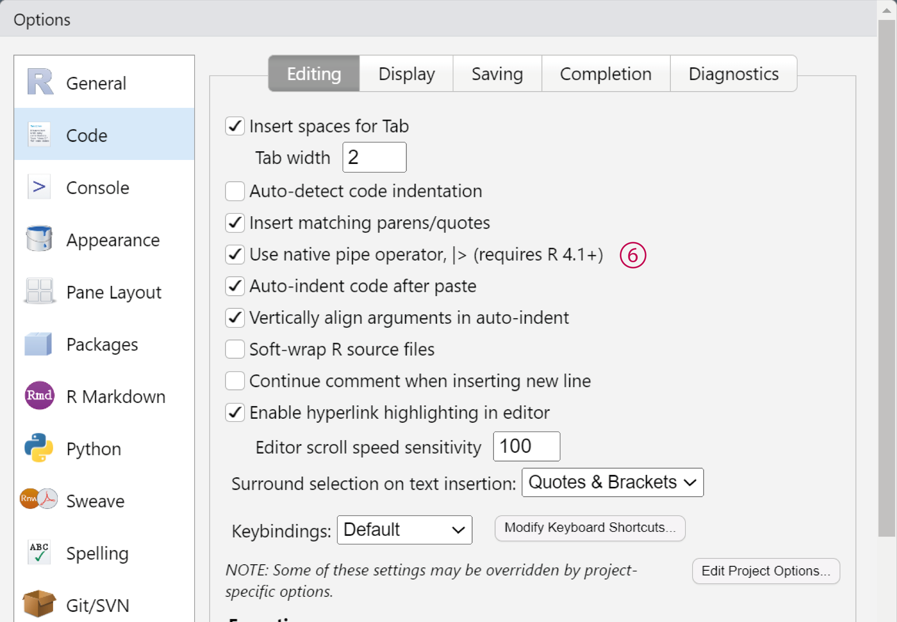

Figura 17: Global options \> Code \> Editing

En la misma a la sección `Code` seleccione la pestaña `Display` y marque
las siguientes opciones de acuerdo a la
(<a href="#fig-18" class="quarto-xref">Figura 18</a>).

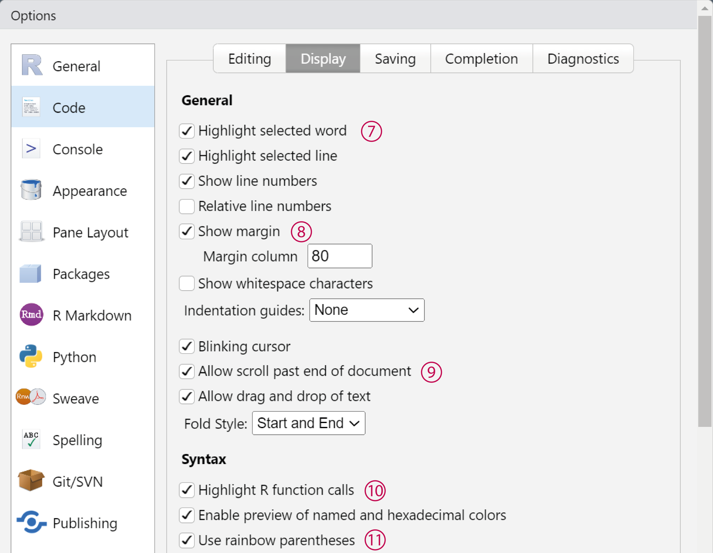

Figura 18: Global options \> Code \> Display

- **Activar** la **casilla** “Highlight selected word” **(7)**.

- **Activar** la **casilla** “Show margin” **(8)**.

- **Activar** la **casilla** “Allow scroll past end of document”
  **(9)**.

- **Activar** la **opción** “Highlight R function calls” **(10)**.

- **Activar** la **casilla** “Rainbow parentheses” **(11)**.

Finalmente diríjase a la pestaña `Saving`, haga clic en el botón
`Change…`, y seleccione la opción `UTF-8`
(<a href="#fig-19" class="quarto-xref">Figura 19</a>).

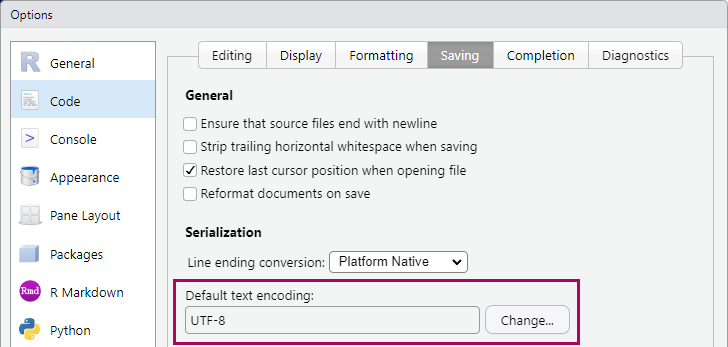

Figura 19: Global options \> Code \> Saving

Para guardar todos estos cambios haga clic en el botón `OK` en la
ventana de `Global` `Options`. Esto cerrará la ventana de `Global`
`Options`volviendo a la ventana principal de RStudio.

> [!NOTE]
>
> La configuración inicial de RStudio se realiza una vez por computador,
> por lo tanto, no es necesario volver a realizar estos pasos la próxima
> vez que utilice RStudio a menos que utilice otro computador.
