<br>

```{r}

```

## Instalación de R

Para instalar la última versión disponible de R ingrese al sitio web de CRAN (*The Comprehensive R Archive Network*) <https://cran.r-project.org/bin/windows/base/>. Una vez allí haga clic en `Download R-4.6.1 for Windows` para iniciar la descarga (@fig-1).

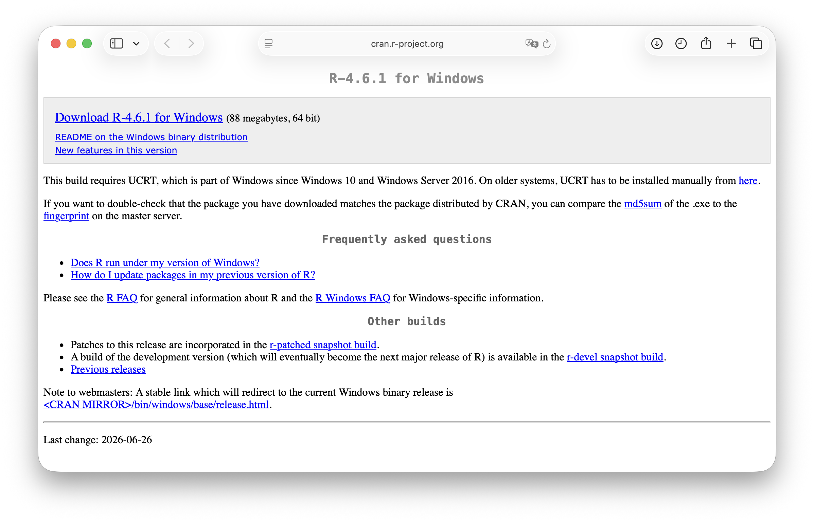{#fig-1 fig-align="center" width="800"}

::: callout-note
Para descargar la versión de R compatible con MacOS ingrese a este link <https://cran.r-project.org/bin/macosx/>.
:::

Luego de finalizada la descarga abra el archivo `R-4.6.1-win.exe` para comenzar con el proceso de instalación. Siga las instrucciones que aparecen en las imágenes que se muestran a continuación.

1.  **Seleccione** el idioma **Español** y presione **Siguiente**.(@fig-2).

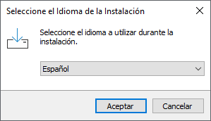{#fig-2 fig-align="center"}

<br>

2.  Presione **Siguiente** para aceptar las condiciones de uso. (@fig-3).

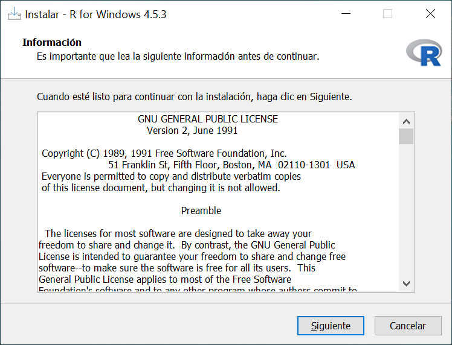{#fig-3 fig-align="center" width="450"}

<br>

3.  Haga clic en **Siguiente** para **aceptar la ruta de instalación** que viene por defecto. (@fig-4).

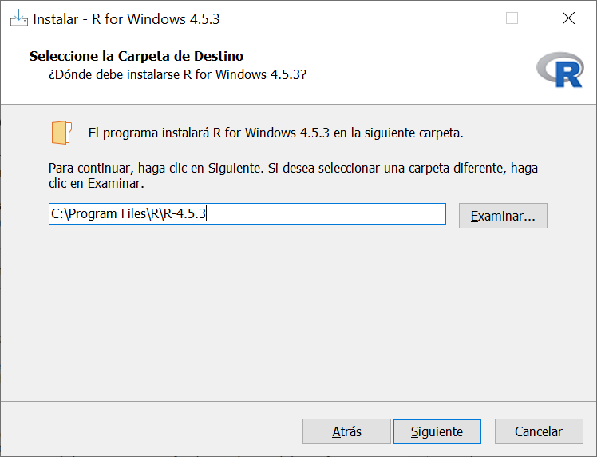{#fig-4 fig-align="center" width="450"}

<br>

4.  En la ventana de la @fig-5 **desactive la casilla Message translations** y luego **presione** **Siguiente**.

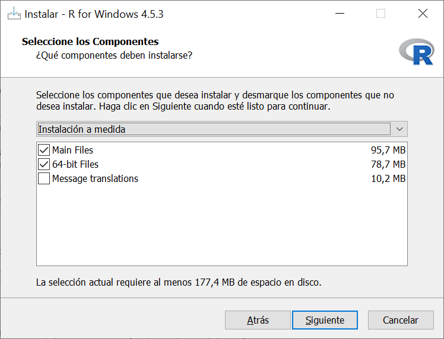{#fig-5 fig-align="center" width="450"}

::: callout-warning
Debido a que la mayoría de la documentación y literatura de R está en inglés se recomienda fuertemente que desactiven la casilla *Message translations*.
:::

<br>

5.  En la ventana de la @fig-6 **escoja la opción** **No** y luego **presione** **Siguiente**.

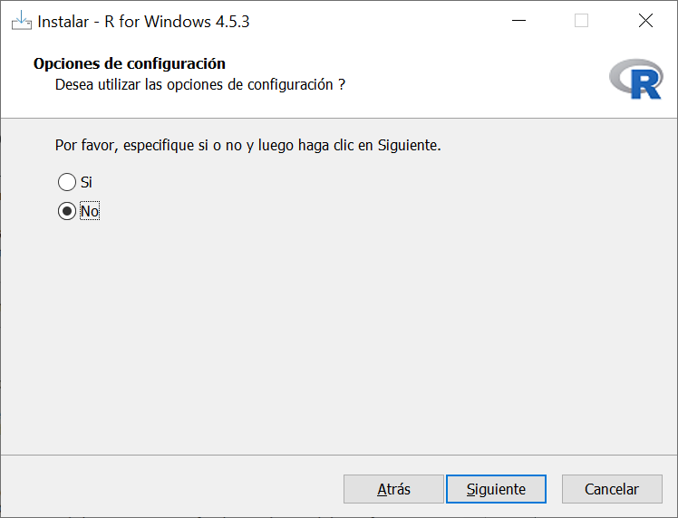{#fig-6 fig-align="center" width="450"}

<br>

6.  En la ventana de la (@fig-7) **presione** **Siguiente** para aceptar que se cree una carpeta en el Menú Inicio.

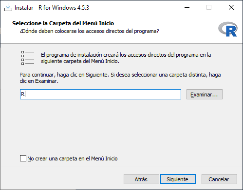{#fig-7 fig-align="center" width="450"}

<br>

7.  **Modifique las casillas** de acuerdo a la @fig-8 y luego **presione** **Siguiente** para comenzar con la instalación.

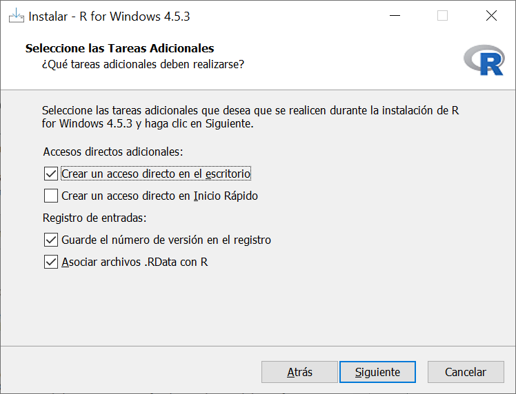{#fig-8 fig-align="center" width="450"}

<br>

Una vez que haya finalizado el proceso de instalación aparecerá una ventana similar a la @fig-9. **Presione Finish** para terminar.

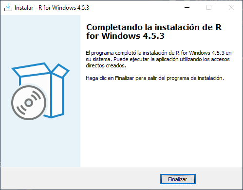{#fig-9 fig-align="center" width="450"}

<br>

Para comprobar que la instalación se haya realizado correctamente haga clic en el Menú Inicio \> carpeta R, y luego abra el archivo que pertenezca a la versión recién instalada. Si la ventana que aparece es similar a la (@fig-10) significa que R se instaló en su computador.

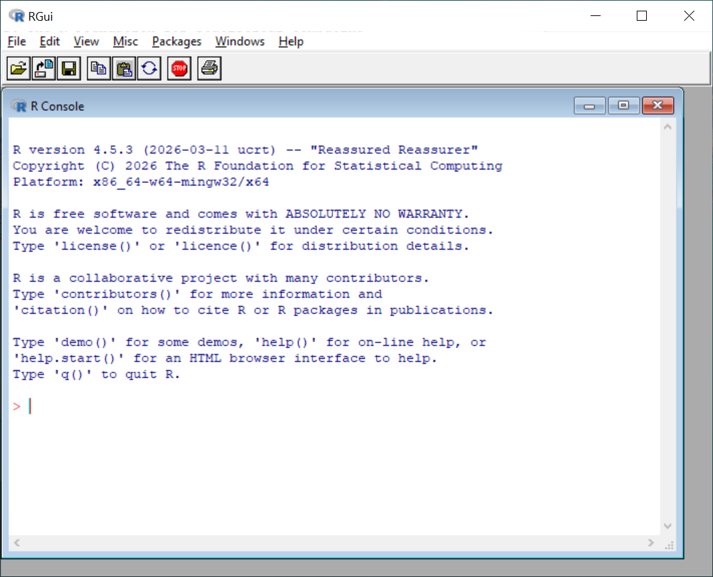{#fig-10 fig-align="center" width="450"}

## Instalación de RStudio

Para descargar la última versión de RStudio ingrese al sitio web [https://posit.co/download/rstudio-desktop/](https://docs.posit.co/ide/user/?_gl=11qayj33_gaNTgxMzMxOTA3LjE3ODA1MTg5MjU._ga_G020NYQMP9czE3ODYwMzI4OTYkbzEkZzAkdDE3ODYwMzI5MDEkajU3JGwwJGgw_gcl_au*MTIxNDQ3Mjk3NC4xNzg2MDMyODk2#direct-downloads-open-source) y haga clic en `RStudio-2026.01.1-147.exe` para la versión de Windows, y en `RStudio-2026.07.1-147.dmg` para la versión de MacOS (@Fig-11) .

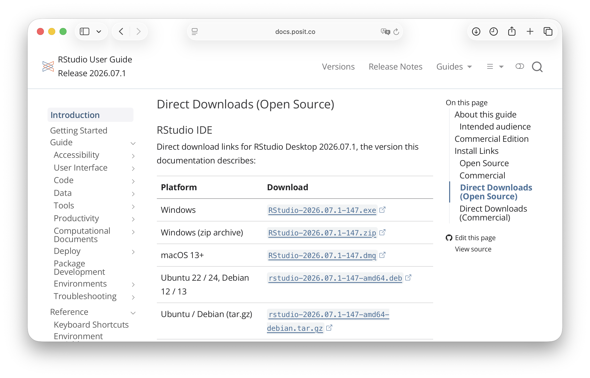{#fig-11 fig-align="center" width="800"}

<br>

Al abrir el archivo descargado se desplegará la ventana de inicio de instalación de RStudio (@Fig-12). Siga las instrucciones que aparecen en las imágenes que se muestran a continuación.

1.  **Presione** el botón **Siguiente** (@Fig-12).

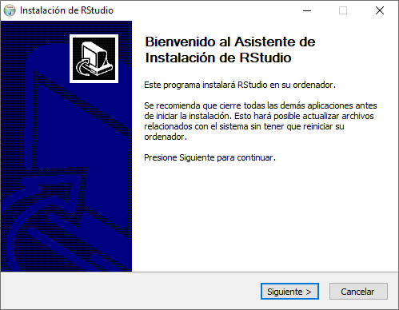{#fig-12 fig-align="center" width="450"}

<br>

2.  **Acepte la ruta de instalación** que aparece por defecto (@Fig-13). **Para finalizar** la instalación **haga clic** en **Instalar**.

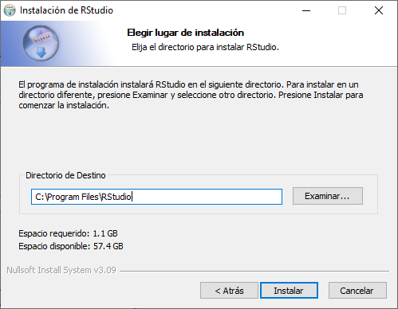{#fig-13 fig-align="center" width="450"}

<br>

3.  Una vez finalizada la instalación aparecerá una ventana similar a la @Fig-14. Haga **clic** en **Terminar** para completar el proceso de instalación.

    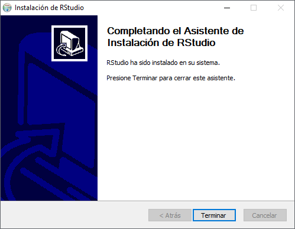{#fig-14 fig-align="center" width="450"}

Para comprobar que RStudio se instaló correctamente haga clic en el Menú Inicio y luego en la aplicación RStudio. Si se despliega una ventana similar a la @Fig-15 significa que la instalación se realizó de forma correcta.

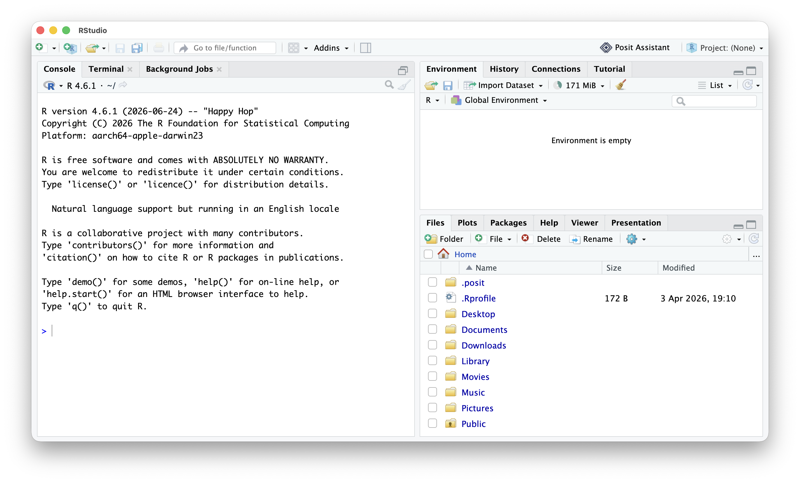{#fig-15 fig-align="center" width="800"}

## Configuración inicial de RStudio

A continuación se configurarán algunas opciones generales que serán de ayuda para interactuar de manera más fácil con RStudio.

En la barra superior de la ventana de RStudio (@fig-15) haga clic en `Tools` \> `Global Options` \> sección `General` \> y luego en la pestaña `Basic` (@fig-16).

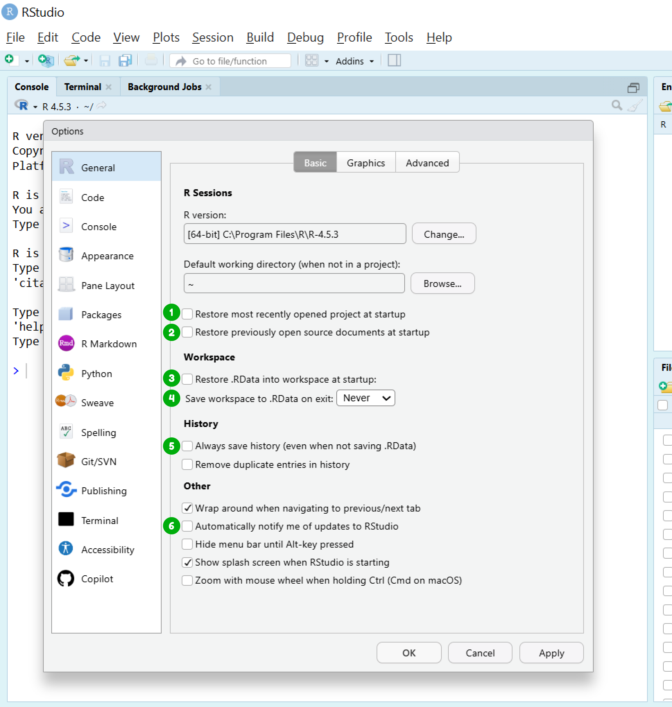{#fig-16 fig-align="center" width="692"}

Observe esta pestaña y ajuste las opciones de acuerdo a lo siguiente:

- {width="25"} **Desactivar** la **casilla** “Restore most recently opened project at startup”.

- {width="25"}**Desactivar** la **casilla** “Restore previously open source document at startup”.

- {width="25"}**Desactivar** la **casilla** “Restore .RData into workspace at startup”.

- {width="25"}**Escoger** la **opción** “Never” en la casilla “Save workspace to .RData on exit”.

- {width="25"}**Desactivar** la **casilla** “Always save history (even when not saving.RData)”.

- {width="25"}**Desactivar** la **casilla** “Automatically notify me of updates of RStudio”.

<br>

Diríjase a la sección `Code` y seleccione la pestaña `Editing` (@fig-17). Una vez ahí **active la casilla** “Use native pipe operator, \|\> (requires R 4.1+)”{width="25"} .

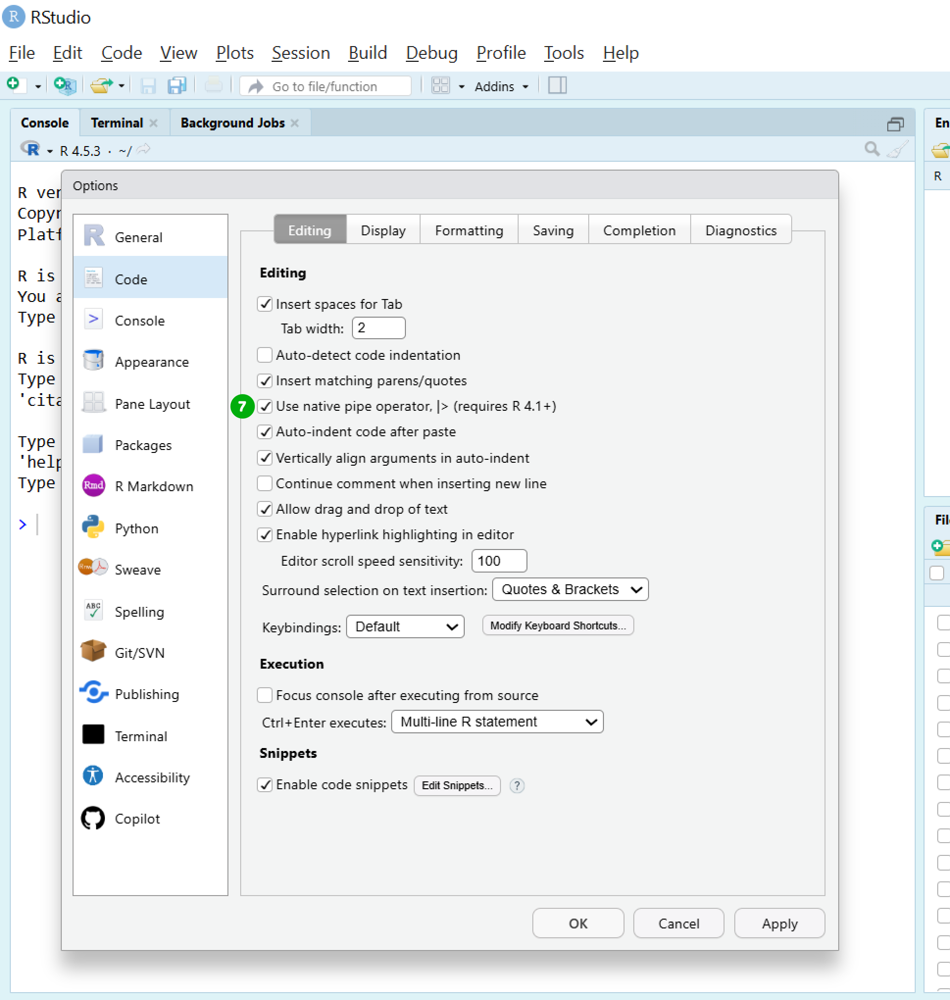{#fig-17 fig-align="center"}

En la misma a la sección `Code` seleccione la pestaña `Display` y marque las siguientes opciones de acuerdo a la (@fig-18).

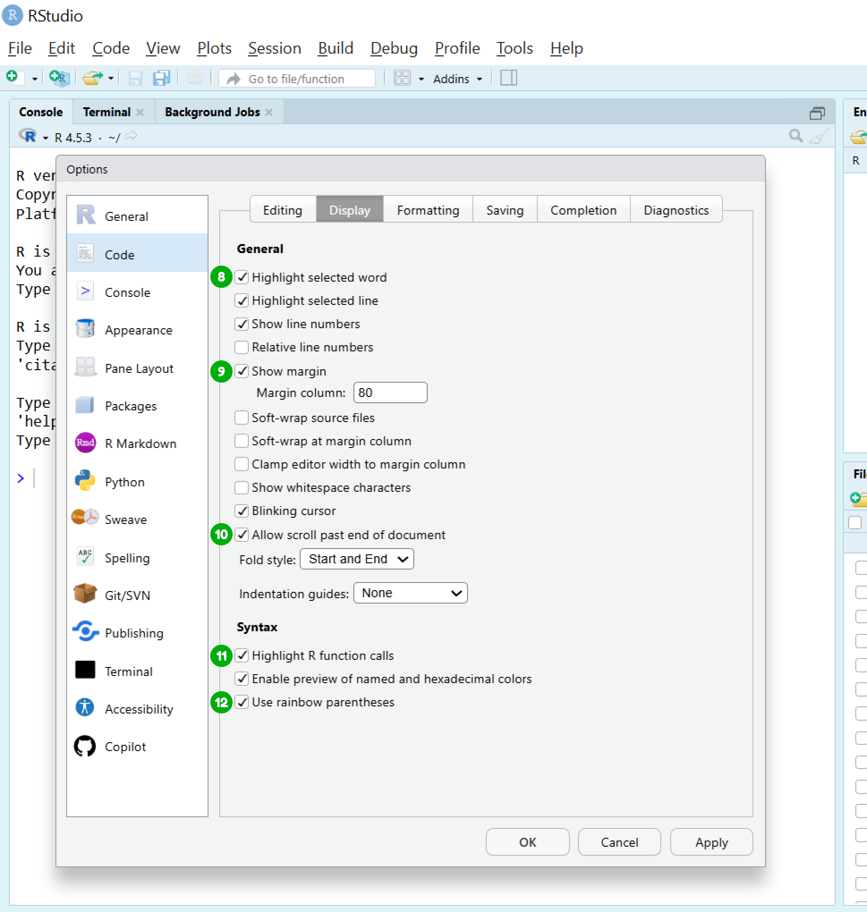{#fig-18 fig-align="center"}

- {width="25"}**Activar** la **casilla** “Highlight selected word”.

- {width="25"}**Activar** la **casilla** “Show margin”.

- {width="25"}**Activar** la **casilla** “Allow scroll past end of document”.

- {width="25"}**Activar** la **opción** “Highlight R function calls”.

- {width="25"}**Activar** la **casilla** “Rainbow parentheses”.

Finalmente diríjase a la pestaña `Saving`, haga clic en el botón `Change…` y seleccione la opción `UTF-8` (@fig-19) {width="25"}.

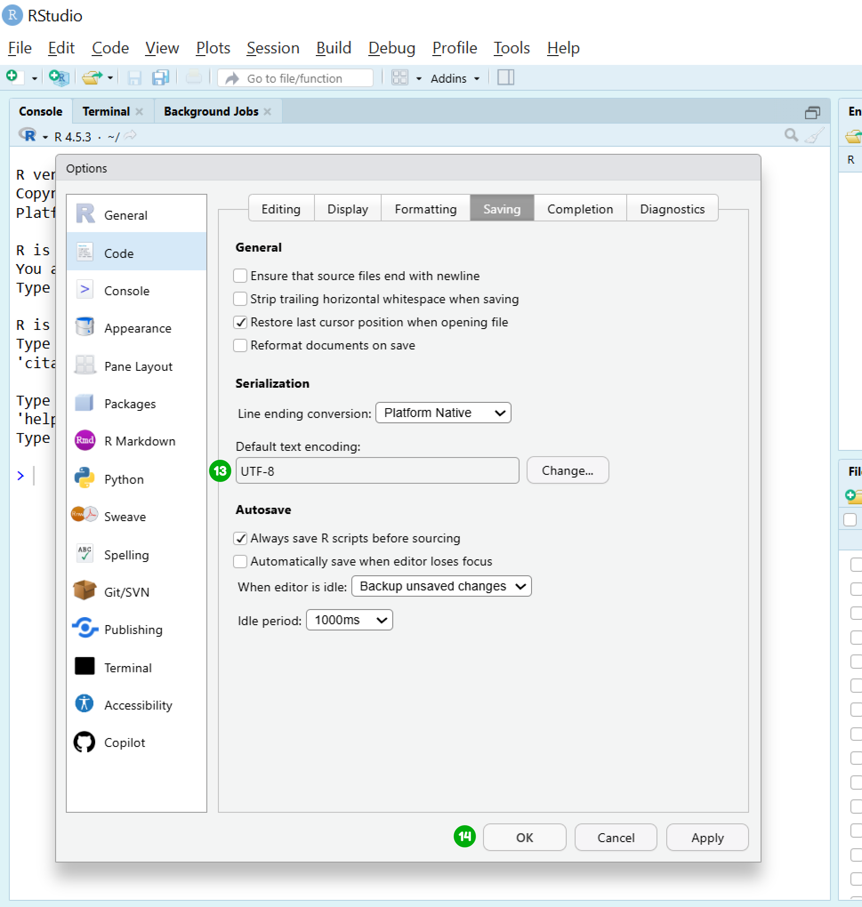{#fig-19 fig-align="center"}

Para guardar todos estos cambios haga clic en el botón `OK` en la ventana de `Global` `Options` {width="25"}.

::: callout-note
La configuración inicial de RStudio se realiza una vez por computador, por lo tanto, no es necesario hacerla la próxima vez que utilice RStudio a menos que utilice otro computador.
:::